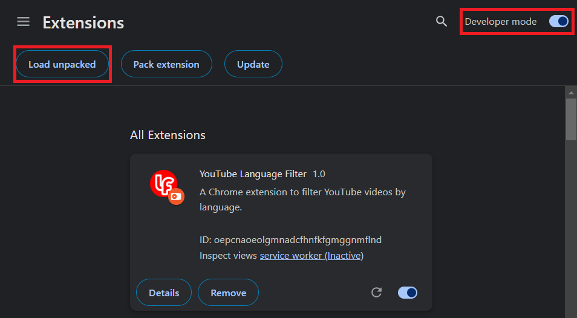

# Youtube Language Filter

A basic Chrome Extension to only display videos in selected languages. 

# Installing :computer:
1- Go to the Extensions page by entering 'chrome://extensions' in a new tab.

2- Enable Developer Mode by clicking the toggle switch next to Developer mode.

3- Click the "Load unpacked" button and select the extension directory that you downloaded.

# Things to note :notebook_with_decorative_cover:

Since it's not possible to get the language of a video by Youtube's API, this extension uses titles and descriptions to infer language. So it does not work very well when video titles and descriptions are short. :/

It also does not hide videos in short format, though it should be possible, I have no benefit in dealing with shorts support since I already hide them with another extension. (You may add that if you want though!) 

I'm not experienced in Chrome environment -nor in web development in general-, so you may see some inconveniences here and there. My main motivation for sharing it, since there is no official or unofficial tools for filtering videos by their language, it can help other people to make a better version of it. 